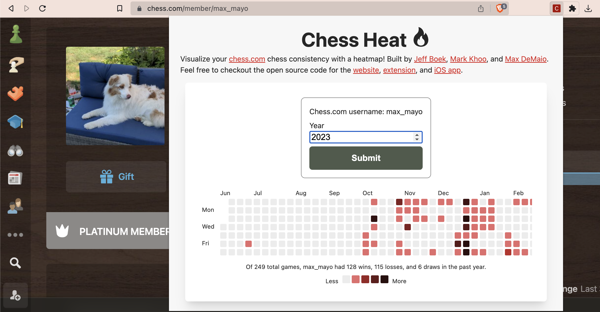

# chess-heat-extension

---

# How it works

Visit any Chess.com user's profile and open the extension to see their chess consistency! So, if you visit `https://chess.com/member/max_mayo`, the extension icon will turn red indicating it's a valid URL. If it's not a valid Chess.com user profile URL, the icon will be gray. Once you click on it, it will load up the current year's heatmap. You can also submit the form for other years!

## How it works (Chrome extension stuff)

The `popup.js` script is loaded by the `index.html` file when the user clicks on the extension icon. This script is responsible for modifying the content of index.html and updating the user interface.

The `background.js` script is loaded by the browser as soon as the extension is installed and runs in the background as long as the extension is enabled. This script is responsible for intercepting events from the browser (like clicking on the extension icon) and executing code in response to these events.

In `background.js` we add a rule for the chrome.declarativeContent API using `chrome.declarativeContent.onPageChanged.addRules()`. The new rule specifies a PageStateMatcher condition that matches URLs that contains "chess.com/member" and uses the HTTPS scheme. If the condition is satisfied, the extension will update its icon using the SetIcon action with a red image icon.

In the case of our Chess Heat example, when the user clicks on the extension icon, the `popup.js` script is executed and it sends a message to the background.js script requesting the name of the chess.com username in the current active tab. The background.js script receives this message and responds with the member name in the current tab. The `popup.js` script then receives the response and updates the content of `index.html` based on the member name. If it can't find a member name (`{name: null}`) response from `background.js`), it'll just display an error.

So the `background.js` script acts as a mediator between the `popup.js` script and the current browser tab, allowing the popup to access information from the tab without having direct access to it.

Fun find: Devtools windows are ignored by the tabs.query API. This means `tabs` will be an empty array when you try and refresh with the Devtools window open for the extension's `index.html` file and you refresh with `Ctrl+R`. So, what you should do is just open the extension and then look at the console errors afterwards in the extension's `index.html` Devtools. Link to this: https://bugs.chromium.org/p/chromium/issues/detail?id=462939.
